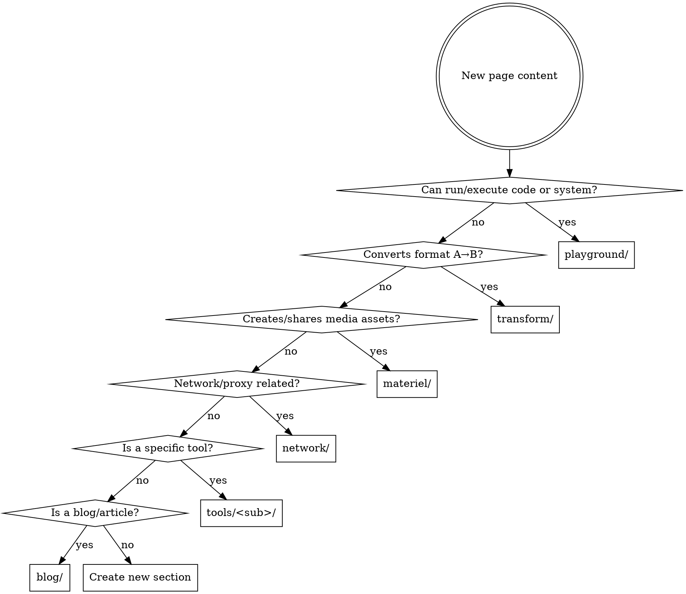

# Hugo Build Toolkit

## Overview

Build and preview Hugo static site pages using the `build-toolkit` docker-compose service. The image `tomhjx/hugo:dev-docsy0.4.0` is pre-built with Hugo v0.101.0 + Docsy theme v0.4.0 + Node.js 16 + PostCSS.

Image source: https://github.com/tomhjx/hugo/blob/main/docker/docsy0.4.0/Dockerfile

## Project Structure

```
home.source/
├── docker-compose.yml        # build-toolkit service definition
├── src/
│   ├── config.yaml           # Hugo site config
│   ├── archetypes/           # Content templates
│   ├── content/              # Markdown content pages
│   ├── layouts/              # Custom Hugo layouts
│   ├── assets/               # Hugo asset pipeline
│   ├── static/               # Static files (JS, CSS, images)
│   ├── themes/               # (empty, theme baked into image at /var/www/themes/docsy)
│   └── public/               # Build output
```

## Quick Reference

| Task | Command |
|------|---------|
| Build site | `docker compose run --rm -e TZ=Asia/Shanghai -v $(pwd)/src/static:/var/www/static -v $(pwd)/src/layouts:/var/www/layouts -v $(pwd)/src/assets:/var/www/assets -v $(pwd)/public:/var/www/public build-toolkit hugo --minify --config config.yaml` |
| Preview (dev server) | `docker compose run --rm -p 1313:1313 -e TZ=Asia/Shanghai -v $(pwd)/src/static:/var/www/static -v $(pwd)/src/layouts:/var/www/layouts -v $(pwd)/src/assets:/var/www/assets build-toolkit hugo server --bind 0.0.0.0 --config config.yaml` |
| Create new content | `docker compose run --rm build-toolkit hugo new content/<section>/<slug>.md` |
| Hugo help | `docker compose run --rm build-toolkit hugo --help` |

## Build Details

### docker-compose.yml Base Config

The `build-toolkit` service provides:
- **Image**: `tomhjx/hugo:dev-docsy0.4.0`
- **Working dir**: `/var/www` (Hugo site root)
- **Mounted volumes** (from docker-compose.yml):
  - `./src/archetypes` → `/var/www/archetypes`
  - `./src/content` → `/var/www/content`
  - `./src/config.yaml` → `/var/www/config.yaml`

### Additional Volumes Needed for Full Build

The docker-compose.yml only mounts archetypes, content, and config. For a full build, you must also mount:

```bash
-v $(pwd)/src/static:/var/www/static
-v $(pwd)/src/layouts:/var/www/layouts
-v $(pwd)/src/assets:/var/www/assets
-v $(pwd)/public:/var/www/public    # output directory
```

### Image Contents (Pre-baked)

The Docker image already contains:
- Hugo v0.101.0 (extended) at `/usr/local/bin/hugo`
- Docsy theme v0.4.0 at `/var/www/themes/docsy`
- Node.js 16, PostCSS, Autoprefixer, Bootstrap (for Docsy)

## Content Routing

When creating a new page, determine the correct section by matching the page's functionality to the categories below. If none fits, create a new section.

### Section Registry

| Section | Path | Description | Content Examples |
|---------|------|-------------|------------------|
| **playground** | `content/playground/` | Run code or systems online | `go.md`, `python.md`, `sql.md`, `rust.md`, `FreeDOS.md` |
| **transform** | `content/transform/` | Format/encoding conversion tools | `json2go.html`, `base64encoder.html`, `urlencoder.html`, `curl2code.md` |
| **materiel** | `content/materiel/` | Create or share images, video, copywriting | `image-placeholder.html` |
| **network** | `content/network/` | Network utilities and proxy tools | `ip-information.html`, `free-proxies-clashx.md` |
| **tools** | `content/tools/<sub>/` | Categorized tool collections (has sub-sections) | `tools/ai/chatgpt-desktop.md` |
| **blog** | `content/blog/` | Blog posts and articles | (not shown on homepage) |
| **docs** | `content/docs/` | Project documentation | (not shown on homepage) |
| **examples** | `content/examples/` | Example/demo pages | — |

### Routing Decision Flow



### Creating a New Section

When no existing section fits, create a new one:

1. Create directory: `src/content/<new-section>/`
2. Create `_index.md` following this template:
   ```markdown
   ---
   title: "<Section Title>"
   weight: 20
   description: >
       <Short description of what this section contains.>
   menu:
     main:
       weight: 20
   ---
   ```
3. If the section should appear on the homepage, add it to `src/content/_index.md`:
   ```
   
   ```

## Common Mistakes

| Mistake | Fix |
|---------|-----|
| Missing static/layouts/assets mounts | Add `-v` flags for these directories when building |
| Output not appearing | Mount `$(pwd)/public:/var/www/public` for build output |
| Timezone wrong in generated dates | Add `-e TZ=Asia/Shanghai` |
| Port not accessible for dev server | Add `-p 1313:1313` and use `--bind 0.0.0.0` |
| Theme not found error | Theme is baked into image; do NOT mount an empty `themes/` over it |
